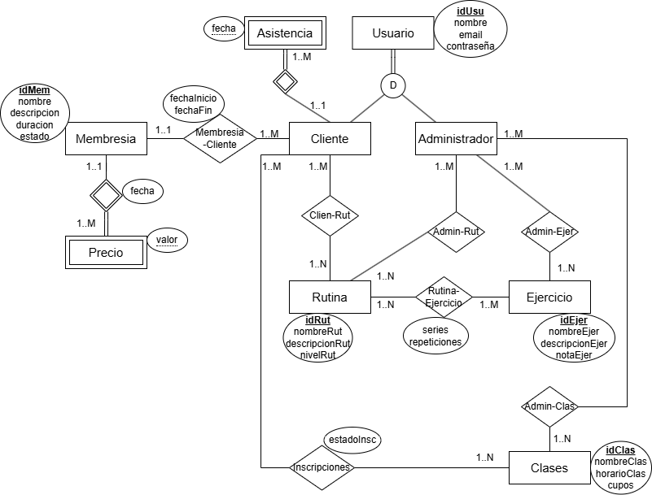

# Propuesta TP DSW

## Grupo
### Integrantes
* 49718 - Passe Alejo
* 52824 - Pinatti Sebastián
* 48881 - Calderon Bruno
* 54343 - Cordoba Santiago

### Repositorios
* [fullstack app](https://github.com/AlejoPasse/TpDesarrollo.git)

## Tema
### Descripción

### Modelo

## Alcance Funcional 

### Alcance Mínimo

Regularidad:
|Req|Detalle|
|:-|:-|
|CRUD simple|1. CRUD Usuario 2. CRUD Rutina 3. CRUD Ejercicio 4. CRUD Membresía|
|CRUD dependiente|1. CRUD Precio {depende de} CRUD Membresía 2. CRUD Asistencia {depende de} CRUD Usuario|
|Listado + detalle| 1. Listado de habitaciones filtrado por tipo de habitación, muestra nro y tipo de habitación => detalle CRUD Habitacion  2. Listado de reservas filtrado por rango de fecha, muestra nro de habitación, fecha inicio y fin estadía, estado y nombre del cliente => detalle muestra datos completos de la reserva y del cliente|
|CUU/Epic|1. Obtener listado de rutinas de un cliente 2. Adquirir una membresía como cliente|

Adicionales para Aprobación
|Req|Detalle|
|:-|:-|
|CRUD |1. CRUD Usuario 2. CRUD Rutina 3. CRUD Ejercicio 4. CRUD Membresía 5. CRUD Clases 6. CRUD Precio 7. CRUD Asistencia|
|CUU/Epic|1. Obtener listado de rutinas de un cliente 2. Adquirir una membresía como cliente 3. Gestionar rutina como adminisitrador 4. Inscribirse a una clase como cliente|

### Alcance Adicional Voluntario

*Nota*: El Alcance Adicional Voluntario es opcional, pero ayuda a que la funcionalidad del sistema esté completa y será considerado en la nota en función de su complejidad y esfuerzo.

|Req|Detalle|
|:-|:-|
|Listados |1. Estadía del día filtrado por fecha muestra, cliente, habitaciones y estado  2. Reservas filtradas por cliente muestra datos del cliente y de cada reserve fechas, estado cantidad de habitaciones y huespedes|
|CUU/Epic|1. Consumir servicios 2. Cancelación de reserva|
|Otros|1. Envío de recordatorio de reserva por email|

